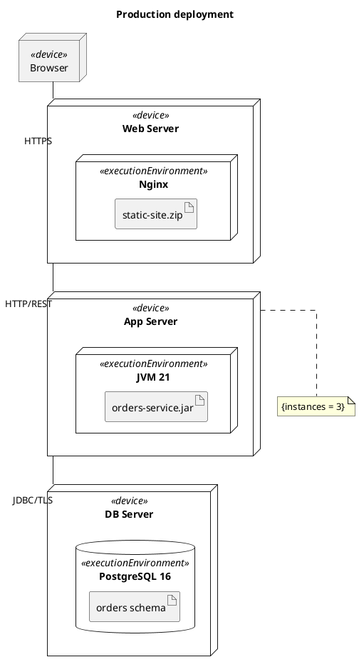

# PlantUML — Deployment diagrams

Rules live in `references/deployment.md`; this file is syntax only.

```plantuml
@startuml
title Production deployment
skinparam linetype ortho

node "Browser" <<device>> as client {
}
node "Web Server" <<device>> as web {
  node "Nginx" <<executionEnvironment>> {
    artifact "static-site.zip"
  }
}
node "App Server" <<device>> as app {
  node "JVM 21" <<executionEnvironment>> {
    artifact "orders-service.jar" as jar
  }
}
note right of app : {instances = 3}
node "DB Server" <<device>> as dbs {
  database "PostgreSQL 16" <<executionEnvironment>> {
    artifact "orders schema"
  }
}
client -- web : HTTPS
web -- app : HTTP/REST
app -- dbs : JDBC/TLS
@enduml
```
