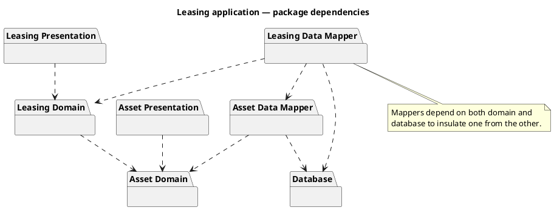
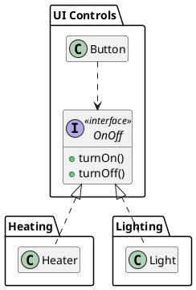

# PlantUML — Package diagrams

Rules live in `references/package.md`; this file is syntax only.

```plantuml
@startuml
title Leasing application — package dependencies
skinparam packageStyle folder
hide empty members

package "Leasing Presentation" as LP {
}
package "Asset Presentation" as AP {
}
package "Leasing Domain" as LD {
}
package "Asset Domain" as AD {
}
package "Leasing Data Mapper" as LM {
}
package "Asset Data Mapper" as AM {
}
package "Database" as DB {
}

LP ..> LD
AP ..> AD
LD ..> AD
LM ..> LD
LM ..> DB
AM ..> AD
AM ..> DB
LM ..> AM
note bottom of LM : Mappers depend on both domain and\ndatabase to insulate one from the other.
@enduml
```

Separated interface (client owns the interface):

```plantuml
@startuml
hide empty members
package "UI Controls" {
  class Button
  interface OnOff <<interface>> {
    + turnOn()
    + turnOff()
  }
  Button ..> OnOff
}
package "Heating" {
  class Heater
}
package "Lighting" {
  class Light
}
OnOff <|.. Heater
OnOff <|.. Light
@enduml
```
