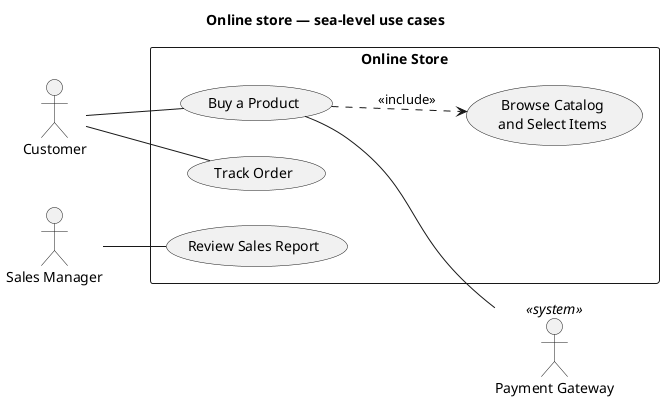

# PlantUML — Use cases (text first, diagram second)

Rules live in `references/use-case.md`; this file is syntax only.

```plantuml
@startuml
title Online store — sea-level use cases
left to right direction
skinparam packageStyle rectangle

actor Customer
actor "Sales Manager" as SM
actor "Payment Gateway" as PG <<system>>

rectangle "Online Store" {
  usecase "Buy a Product" as Buy
  usecase "Browse Catalog\nand Select Items" as Browse
  usecase "Track Order" as Track
  usecase "Review Sales Report" as Report
}

Customer -- Buy
Customer -- Track
SM -- Report
Buy -- PG
Buy ..> Browse : <<include>>
@enduml
```
